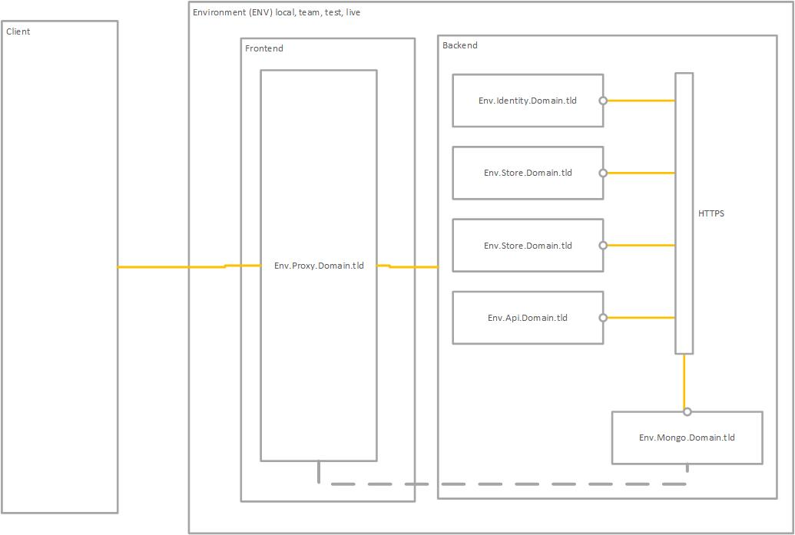

# Networking

Its a docker controlled sub-net inside your machine, analogous to group of VM's inside a VNET in the cloud with a public IP address leading only to the reverse proxy font end.

# Network notes

The docker sub-net network is agnostic about its actual run time IP Addresses and this 
solution leverages the automatic DNS feature of docker to provide 
container-to-container communications through their deterministic host names.

Container-to-container communications:
* (A) are (mediated) proxied by the proxy service if addresses use the the main domain  ```local.myInfo.world``` and application base paths. e,g, https://local.myInfo.world/api
* (B) are direct if the addresses use the actual sub-domain host name for the service e.b. https://api.local.myInfo.world/api


## Network topology

This text diagram illustrates the host and docker network setup.

```
.___________________________________________________________________________________________.
|                                                                                           |
|                    .___________________________________________________________________.  |
| Development host   | Docker        Front End             Back End                      |  |
| Network (localhost)| sub_network  ._____________.       ._________________________.    |  |
|                    |              |             |       |                B  =     |    |  |
| Visual Studio      |              |             |       |  .___________.    |     |    |  |
| Browser            |              |             |   A   |->| store     |<-->|     |    |  |
| Postman            |              |             | https |  `___________'    |     |    |  |
| Console            |              |             |<------|                   |     |    |  |
|                    |              | .________.  |       |  .___________.    |     |    |  |
|         https   ------------------->| proxy  |--https-->|->| identity  |<-->|     |    |  |
|                    |        ^     | `________'  |       |  `___________'    |     |    |  |
|         http    ------------'     |             |       |             https-|     |    |  |
|                    | 301 redirect |             |       |  .___________.    |     |    |  |
|                    |              |             |       |->| support   |<-->|     |    |  |
|                    |              |             |       |  `___________'    |     |    |  |
|                    |              `_____________'       |                   |     |    |  |
|                    |                         |          |  .___________.    |     |    |  |
|  Other protocols------ and ports disabled-x  |       -->|->| api       |<-->|     |    |  |
|  Disabled          |                         |          |  `___________'    |     |    |  |
|                    |                         |          |                   |     |    |  |
|                    |                         |          |  .___________.    |     |    |  |
|  Except mongodb    |   Port   27017          `--------->|->| MongoDB   |<-->|     |    |  |
|                    |   For debugging only               |  `___________'    =     |    |  |
|                    |                                    `_________________________'    |  |
|                    `___________________________________________________________________'  |
`___________________________________________________________________________________________'
```

This  shows it slightly more easily.


All services are provided with a discrete service certificate with ```localhost```  as the CN  and all the required domain and sub-domains as SAN (Subject Alternative Names) names. The default of ```localhost``` stops ASP.NET debugging from complaining about a ``localhost`` trusted certificate on startup.

All transport is encrypted. 

Clearly here, network transmission performance is reduced over a Front end TLS and backed http only scenario, due to increased TLS handshaking per request.

The decision here was to trade that performance drop for increased transport security on the basis that ```security should never be undermined by performance considerations```.

Any inadvertent exposure of back end services to the outside world can therefore fall back on TLS. (Strength in depth)

Outside world can only access the proxy at local.myInfo.world where port 80 (http) forces a redirect to port 443 (https).

The Proxy can access all back end services only on port 443

All back end services can access all services via the Proxy via port 443 (https) or the mongoDB port 27017. Each service may access any other service directly by any other exposed port. 

Certificates provided for each service and each has the development root CA certificate available to trust those services certificates.

# Application mapping in proxy configuration

With 5 defined externally useful application base path mappings of;

```
/
/store/
/support/
/identity/
/api/
```

With reference to  the above locations, the trailing "/" is important as it means that 
for example the application path of ```/store``` is mapped along with all of its sub URL's.


# Addressing scheme 
The following URL's are supported correctly. 
The self referencing links inside the views of the micro services behave properly.
The following URL's are tested in this order.

```

External Request URL's through the proxy                             | Route to back-end service Uri's
_____________________________________________________________________|________________________________________________________________________
https://local.myInfo.world/identity/.well_lnown/openid_configuration | https://identity.local.myInfo.world/identity/.well_lnown/openid_configuration
https://local.myInfo.world                                           | https://store.local.myInfo.world/store/
https://local.myInfo.world/store                                     | https://store.local.myInfo.world/store/
https://local.myInfo.world/store/home                                | https://store.local.myInfo.world/store/home
https://local.myInfo.world/store/home/privacy                        | https://store.local.myInfo.world/store/home/privacy
https://local.myInfo.world/support                                   | https://support.local.myInfo.world/support/
https://local.myInfo.world/support/home                              | https://support.local.myInfo.world/support/home
https://local.myInfo.world/support/home/privacy                      | https://support.local.myInfo.world/support/home/privacy
https://local.myInfo.world/support/home/privacy                      | https://support.local.myInfo.world/support/home/privacy
https://local.myInfo.world/api/identity                              | https://api.local.myInfo.world/api/identity
https://local.myInfo.world/api/weatherforecast                       | https://api.local.myInfo.world/api/weatherforecast

```


Redirect Uri's from web views are acted on via the external browser so should pass through the proxy routes as shown above.

Direct non-browser http service to service calls in the back-end may be requested without recourse to passing through the proxy and use the RHS addresses shown above.

## Https is enforced

```
Http access                | http://*  redirects to https://*
________________________________________________________________________________________________________________
Default Store access       | https://local.myInfo.world is served direct from myinfo.store index view
Store access via path      | https://local.myInfo.world/store  is served direct from myinfo.store index view
Support access via path    | https://local.myInfo.world/support is served direct from myinfo.support index view
```

## Relative Url's

URL inter_site redirects from myinfo.store container to  myinfo.support container and vis-a-versa work as expected and intra-site urls using controller actions work as expected

Example index.cshtml from Store shows a self referenceing controller action link and a standard domain relative ``` href="/support"``` link to the support site from the store;

```
@{
    ViewData["Title"] = "Home Page";
}

<div class="text_center">
    <h1 class="display_4">Welcome to the Store</h1>
    <p>Learn about <a class="nav_link text_dark" asp_area="" asp_controller="Home" asp_action="Privacy">our privacy policy</a></p>

    <p>Get some <a class="nav_link text_dark" href="/support">support</a></p>
</div>
```

